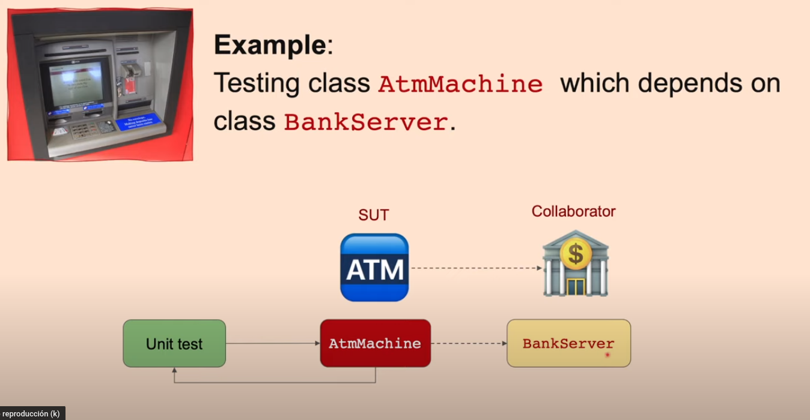

# Test-GMock-2

## Overview

This repository contains some tests using [GoogleMock](https://google.github.io/googletest/gmock_cook_book.html) together with CMake.

Please, refer first to my repository [test-gtest](https://github.com/RicardoRagel/test-gtest) to check how to setup and use Google Test, and to my other repository [test-gmock-1](https://github.com/RicardoRagel/test-gmock-1) to see some examples about GMock Matchers. The setup and usage of this repository is the same, the only difference is the kind of tests that it will be performed by the [example_test.cpp](test/example_test.cpp) file. 

In the case of this repository, we will use **gMock Classes**, defining them, and "test" if their "expectations" are accomplished.

## What is Mocking?

Basically, it means create a "dummy" (although this term should not be used for a mock) interface of a dependency that our program has, so we can test our program without the necessity of that dependency is there and we can use it. Check [this video](https://www.youtube.com/watch?v=vxCH4AuVRgo&t=79s) to get a really good example about it. Take also into account that the example used in the video is the same than this repository is also using:

## References

* [Google Test documentation](http://google.github.io/googletest/)
* [Tutorial video](https://www.youtube.com/watch?v=vxCH4AuVRgo&t=79s)
* [Tutorial repository](https://github.com/ourarash/cpp-template). Notice that it uses [Bazel](https://bazel.build/) instead of CMake.